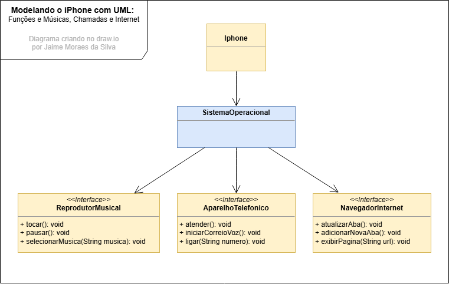

# POO - Desafio DIO

### Modelagem e Diagramação de um Componente iPhone

### Objetivo
1. Criar um diagrama UML que represente as funcionalidades descritas.

2. Implementar as classes e interfaces correspondentes em Java (Opcional).

### Diagrama UML do projeto

 
*Modelo Criado no draw.io*

### Implementando classe e interfazer 
Foi criado as três classe para cada função do aparelho. Resolvi adcionar uma classe Sistema operacional para implementar e controlar os aplicativos.

